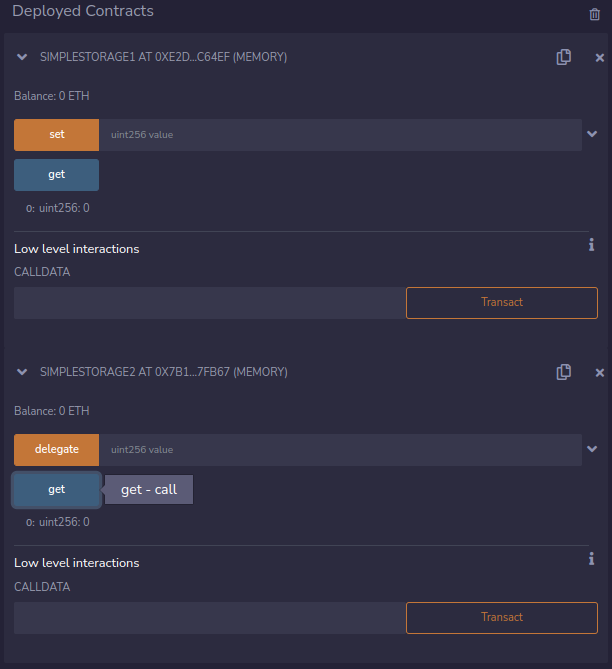
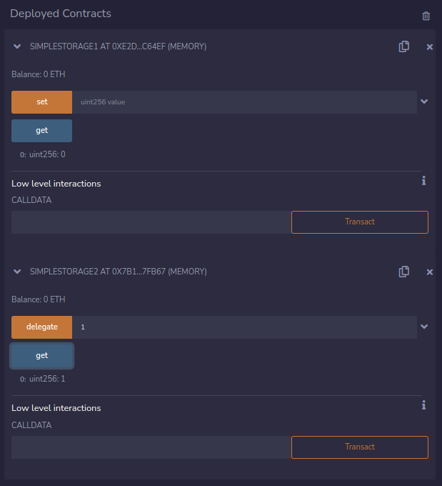

- [Challenge](#challenge)
- [Solution](#solution)
  - [delegatecall()](#delegatecall)
  - [Solution (continued)](#solution-continued)
- [Remediation](#remediation)
- [References](#references)
   
# Challenge

The level reads:

> The goal of this level is for you to claim ownership of the instance you are given.
>
>  Things that might help
>
> - Look into Solidity's documentation on the delegatecall low level function, how it works, how it can be used to delegate operations to on-chain libraries, and what implications it has on execution scope.
> - Fallback methods
> - Method ids

And gives the following contract's code:

```solidity
// SPDX-License-Identifier: MIT
pragma solidity ^0.8.0;

contract Delegate {

  address public owner;

  constructor(address _owner) {
    owner = _owner;
  }

  function pwn() public {
    owner = msg.sender;
  }
}

contract Delegation {

  address public owner;
  Delegate delegate;

  constructor(address _delegateAddress) {
    delegate = Delegate(_delegateAddress);
    owner = msg.sender;
  }

  fallback() external {
    (bool result,) = address(delegate).delegatecall(msg.data);
    if (result) {
      this;
    }
  }
}
```

# Solution

For this level, we have to take ownership of the `Delegation` contract. But as we can see in the code, there is no function that changes the owner... The owner is being set in the initialization of the contract, and it's then never modified (or that's what it seems, right?)

There is only one function defined in that contract, which is the `fallback()` function. This function calls the function `delegatecall()` on the `Delegate` contract with the `msg.data` as input. 

Let's see what `delegatecall()` is.

## delegatecall()

> There exists a special variant of a message call, named delegatecall which is identical to a message call apart from the fact that the code at the target address is executed in the context of the calling contract and msg.sender and msg.value do not change their values. This allows a smart contract to dynamically load code from a different address at runtime. Storage, current address and balance still refer to the calling contract.
>
> Calling into untrusted contracts is very dangerous, as the code at the target address can change any storage values of the caller and has full control over the caller's balance.

> If storage variables are accessed via a low-level delegatecall, the storage layout of the two contracts must align in order for the called contract to correctly access the storage variables of the calling contract by name. This is of course not the case if storage pointers are passed as function arguments as in the case for the high-level libraries.

So, what `delegatecall` does, is to, as its name states, "delegate" the execution of some code to another contract. Note that the contract called with `delegatecall`, the callee, is going to have the ability to change the caller variables states and also the `msg.sender` is going to be the same `msg.sender` of the caller.

Let's see an example:

`SimpleStorage1.sol`

```solidity
// SPDX-License-Identifier: MIT
pragma solidity ^0.8.0;

contract SimpleStorage1 {
    uint256 private s_storedData;

    function set(uint256 value) public {
        s_storedData = value;
    }

    function get() public view returns (uint256) {
        return s_storedData;
    }
}
```

`SimpleStorage2.sol`

```solidity
// SPDX-License-Identifier: MIT
pragma solidity ^0.8.0;
import "./SimpleStorage1.sol";

contract SimpleStorage2 {
    uint256 private s_storedData;
    SimpleStorage1 simpleStorage1;

    constructor (address _simpleStorage1Address) {
        simpleStorage1 = SimpleStorage1(_simpleStorage1Address);
    }

    function delegate(uint256 value) public returns (bool) {
        (bool result,) = address(simpleStorage1).delegatecall(abi.encodeWithSignature("set(uint256)", value));
        return result;
    }

    function get() public view returns (uint256) {
        return s_storedData;
    }
}
```

Look at these two contracts they are very similar and almost the same. They both declare a variable called "s_storedData" and have a getter for that variable. The difference is that `SimpleStorage1.sol` has a `set()` function, while `SimpleStorage2.sol` has a `delegate()` function which calls `set()`from the first contract through `delegatecall()`. Let's deploy these contracts and call their `get()` functions in remix:



Now, what is going to happen if we call `delegate(1)` which contract is going to update their variable? SimpleStorage1 or SimpleStorage2? Let's try it:



Note: when we call an external contract function with `call()` or `delegatecall()` our contract doesn't know the ABI that's why we need to specify the target function its function signature. That's why we use `abi.encodeWithSignature()`.

## Solution (continued)

So going back to the level. We are interacting with the `Delegation` contract so in order to modify the `owner` it is necessary to call `pwn()` from the `Delegate` contract through `delegatecall`.

First of all we notice that the only call to `Delegate` through `delegatecall` is done in the `fallback()` function from `Delegation`. To execute the `fallback()` function we can call the contract through `sendTransaction()`. And then we have to pass the signature of `pwn()` as input.
To get the signature of `pwn()` we can call:

```javascript
web3.eth.abi.encodeFunctionSignature("pwn()", "")
'0xdd365b8b'
```

Now we can finally execute:

```javascript
await contract.sendTransaction({data: web3.eth.abi.encodeFunctionSignature("pwn()", "")})
```

Now, if we call `await contract.owner()` we see that the response is our own address!! We solved the level :D !!


# Remediation

- Use `delegatecall` with caution and make sure to never call into untrusted contracts. If the target address is derived from user input ensure to check it against a whitelist of trusted contracts.
- Avoid using `delegatecall` as a catch-all forwarding mechanism. (Like in this level, that's being used in the fallback function)


# References

- [SWC-112](https://swcregistry.io/docs/SWC-112)
- [The Parity Wallet Hack Explained](https://blog.openzeppelin.com/on-the-parity-wallet-multisig-hack-405a8c12e8f7)
- [Units and Globally Available Variables](https://docs.soliditylang.org/en/v0.4.24/units-and-global-variables.html?highlight=delegatecall)